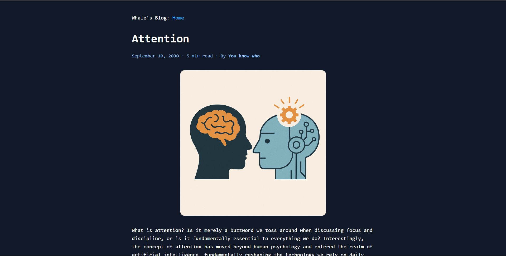

View live site [here](/)




# My Personal Blog

This is a personal blog built with [Eleventy (11ty)](https://www.11ty.dev/), a simple and fast static site generator.  
I use this blog to document my learning journey, thoughts, and experiences.

## 🛠 Tech Stack

- **Static Site Generator**: [Eleventy (11ty)](https://www.11ty.dev/)
- **HTML/CSS/Markdown**: Content and styling
- **Deployment**: You can deploy it on platforms like Netlify, Vercel, or GitHub Pages

## 🚀 Getting Started

### 1. Clone the repository

```bash
git clone https://github.com/your-username/your-blog-repo.git
cd your-blog-repo
```

## 2. Install dependicies

```
npm install
```

## 3. Run development server

```
npm run start
```

## 4. Build for production

```
npm run build
```

## Content

All posts are written in Markdown and located in the `posts/` directory.
Each post includes metadata like `title`, `date`, `tags`, and `estimated reading time`.

## Features

- Minimal and clean layout

- Tag support for posts

- Custom favicon and styling

- Markdown-based content creation

- Ready to deploy
